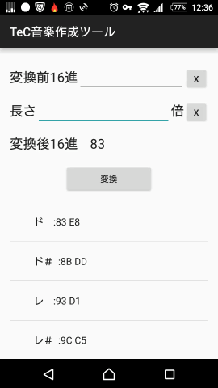

# TeC_Music
学校配布のマイコン(TeC)の音楽作成支援アプリ

## Description
Androidアプリ

TeCというマイコンでは音楽の再生機能がある。この際、音の高さ・長さを2進数で入力する必要がある。
しかしながら、計算が大変なためこのアプリで計算の支援を行う。
実質16進を2進数にして、掛け算をするアプリである。

***DEMO:***

## Features

あらかじめ音の高さ一覧を入れてあるため簡単に2進数を取得できる。

## Usage

1. 変換前16進の入力ボックスに値を入れるか下の音一覧から指定したい音を長押しする
2. 長さを1倍以外にしたい場合は長さのチェックボックスに値を入れる
3. 変換ボタンを押す

## Installation

  [APK Download](/master/MiniPcMusic_1.0.0.apk)
  
Android端末からダウンロードしたAPK選択してインストールしてください。

※APK Downloadを押すとすぐにダウンロードが開始されます
## License

[MIT](LICENSE)
